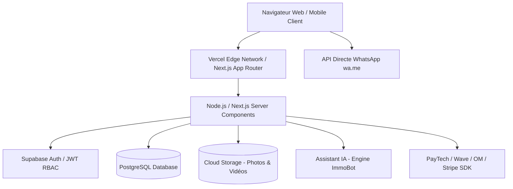

# Documentation Technique - Architecture ImmoSena SaaS

## 1. Vue d'Ensemble du Système

ImmoSena est une plateforme SaaS immobilière multi-tenant conçue pour le marché africain (priorité Sénégal). Elle permet l'interconnexion en temps réel entre les agences immobilières certifiées et les chercheurs de biens.

## 2. Piliers d'Architecture

- **Frontend & App Router** : Next.js 14+ avec Server-Side Rendering (SSR) pour une vitesse de chargement < 1.5s et un score SEO optimal.
- **Multi-Tenant SaaS** : Isolation logique des agences (`agency_id`) garantissant que chaque agence accède uniquement à son catalogue, ses statistiques et ses factures.
- **Rôles & Permissions (RBAC)** :
  1. `ADMIN` : Accès global, modération des annonces, gestion des abonnements et analytique de la plateforme.
  2. `AGENCY` : Gestion des biens (CRUD), changement de statut (Disponible, Loué, Vendu), tableau de bord des clics WhatsApp/Appels et souscription de forfaits.
  3. `CLIENT` : Consultation des annonces, filtre par budget/quartier, demandes de visites et contact direct agence.

## 3. Optimisations Performance & SEO
- Image Optimization automatique (WebP/AVIF via `next/image`).
- Microdata Schema.org (`RealEstateListing`, `SingleFamilyResidence`).
- Compression Gzip / Brotli native.
